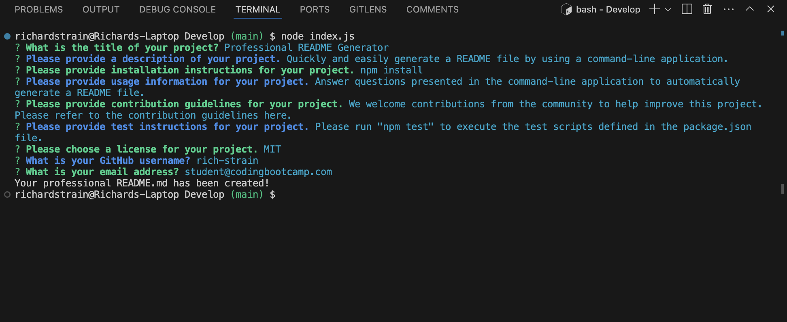

# Professional README Generator

## Description

Automatically generate a README file by answering questions in a command-line application.

## Table Of Contents

- [Installation](#installation)
- [Usage](#usage)
- [Questions](#questions)
- [Screenshot](#screenshot)
- [Video URL](#video-url)

## Installation

```sh
  npm install
```

## Usage

In the root of your application run `node index.js` from the terminal. Answer each question as they presented in the command-line application. After the last question is answered, your responses will be automatically saved to a new README.md file.

## Questions

If you have any questions, feel free to reach out to me at (mailto:[richardstrain@gmail.com]). You can also contact me or view more of my work at https://github.com/git-hub-rich-strain.

## Screenshot



## Video-URL

- https://drive.google.com/file/d/1DBgU7aL1YAOYirc0WX5SMCrqgVIECLid/view?usp=share_link

## Generate README File Location

The generated README file for this challenge can be found in the dist folder.
